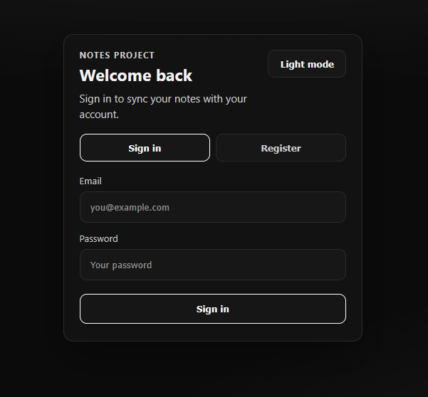
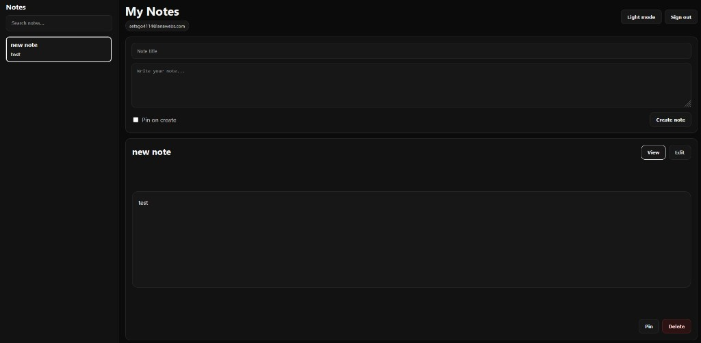

# Notes Project

Full-stack notes application: **ASP.NET Core** REST API, **PostgreSQL** with **Entity Framework Core**, **JWT** access and refresh tokens, and a **React (Vite)** client.

## Screenshots

Dark theme: sign-in / register, then the notes workspace (sidebar, search, create, view & edit, pin, delete, theme toggle, sign out).





---

## English

### Features

- User registration and login with JWT access tokens and refresh token rotation
- CRUD notes per authenticated user (create, list, read, update, delete)
- Optional pinning and search in the web client
- CORS enabled for the Vite dev server (`http://localhost:5173`)
- In **Development**, OpenAPI and a **Scalar** API reference UI are mapped from the API project

### Repository layout

| Path | Role |
|------|------|
| `Note.API` | ASP.NET Core 10 web host, controllers, JWT and CORS configuration |
| `NoteDatabase` | EF Core `DbContext`, repositories, migrations |
| `NoteModels` | Domain models and DTOs |
| `NotesServices` | Business logic (notes and auth) |
| `Notes.Tests` | Unit tests |
| `client` | React + Vite SPA (`axios` for HTTP) |
| `docs/screenshots` | UI images used in this README |

### Prerequisites

- [.NET SDK 10](https://dotnet.microsoft.com/download)
- [Node.js](https://nodejs.org/) (LTS recommended) and npm
- [PostgreSQL](https://www.postgresql.org/) reachable from your machine

### 1. Database

1. Create a database (or use an existing one) in PostgreSQL.
2. Set the connection string in `Note.API/appsettings.Development.json` under `ConnectionStrings:NoteDbContext`.

### 2. JWT settings

Configure `Jwt` in `appsettings.json` and/or `appsettings.Development.json`:

- `Key` — signing secret (use a long random value; the Development sample expects at least 32 characters)
- `Issuer`, `Audience` — must match between token issue and validation
- Optional: `AccessTokenExpirationMinutes`, `RefreshTokenExpirationDays`

### 3. Apply EF Core migrations

From the repository root (with the EF Core tools installed: `dotnet tool install --global dotnet-ef` if needed):

```bash
dotnet ef database update --project NoteDatabase --startup-project Note.API
```

### 4. Run the API

```bash
cd Note.API
dotnet run --launch-profile http
```

Default HTTP URL in this repo: `http://localhost:5262`. The client is configured to call `http://localhost:5262/api`.

In Development, open the Scalar UI in the browser (path is usually under `/scalar`; if it differs, check the URL shown when the app starts).

### 5. Run the web client

```bash
cd client
npm install
npm run dev
```

Vite serves the app at `http://localhost:5173` by default.

### Docker (API only)

From the repository root, with Docker using the solution root as build context:

```bash
docker build -f Note.API/Dockerfile -t notes-api .
```

You must supply PostgreSQL connection string and JWT settings at runtime (for example via environment variables or mounted configuration), consistent with how ASP.NET Core reads configuration.

### Tests

```bash
dotnet test Notes.Tests/Notes.Tests.csproj
```

---

## Русский

### Возможности

- Регистрация и вход с JWT (access) и обновляемыми refresh-токенами
- CRUD заметок для каждого авторизованного пользователя
- В веб-клиенте: закрепление заметок и поиск по тексту
- CORS для dev-сервера Vite (`http://localhost:5173`)
- В среде **Development** доступны OpenAPI и документация **Scalar** из проекта API

### Структура репозитория

| Путь | Назначение |
|------|------------|
| `Note.API` | Хост ASP.NET Core 10, контроллеры, JWT и CORS |
| `NoteDatabase` | EF Core `DbContext`, репозитории, миграции |
| `NoteModels` | Модели и DTO |
| `NotesServices` | Сервисный слой (заметки и аутентификация) |
| `Notes.Tests` | Юнит-тесты |
| `client` | SPA на React + Vite (HTTP через `axios`) |
| `docs/screenshots` | Скриншоты интерфейса для README |

### Требования

- [.NET SDK 10](https://dotnet.microsoft.com/download)
- [Node.js](https://nodejs.org/) (желательно LTS) и npm
- [PostgreSQL](https://www.postgresql.org/)

### 1. База данных

1. Создайте БД в PostgreSQL (или используйте существующую).
2. Укажите строку подключения в `Note.API/appsettings.Development.json` в `ConnectionStrings:NoteDbContext`.

### 2. Настройки JWT

В `appsettings.json` и/или `appsettings.Development.json` задайте секцию `Jwt`:

- `Key` — секрет для подписи (длинная случайная строка; в примере Development ожидается не меньше 32 символов)
- `Issuer`, `Audience` — должны совпадать при выдаче и проверке токена
- По желанию: `AccessTokenExpirationMinutes`, `RefreshTokenExpirationDays`

### 3. Применение миграций EF Core

Из корня репозитория (при необходимости установите инструменты: `dotnet tool install --global dotnet-ef`):

```bash
dotnet ef database update --project NoteDatabase --startup-project Note.API
```

### 4. Запуск API

```bash
cd Note.API
dotnet run --launch-profile http
```

В этом репозитории профиль **http** слушает `http://localhost:5262`. Клиент обращается к `http://localhost:5262/api`.

В режиме Development откройте интерфейс Scalar в браузере (обычно путь под `/scalar`; точный адрес может быть в выводе при старте приложения).

### 5. Запуск веб-клиента

```bash
cd client
npm install
npm run dev
```

По умолчанию Vite отдаёт приложение на `http://localhost:5173`.

### Docker (только API)

Из корня репозитория, контекст сборки — корень решения:

```bash
docker build -f Note.API/Dockerfile -t notes-api .
```

Строка подключения к PostgreSQL и параметры JWT нужно передать при запуске контейнера (переменные окружения или конфигурация), в соответствии с механизмом конфигурации ASP.NET Core.

### Тесты

```bash
dotnet test Notes.Tests/Notes.Tests.csproj
```
